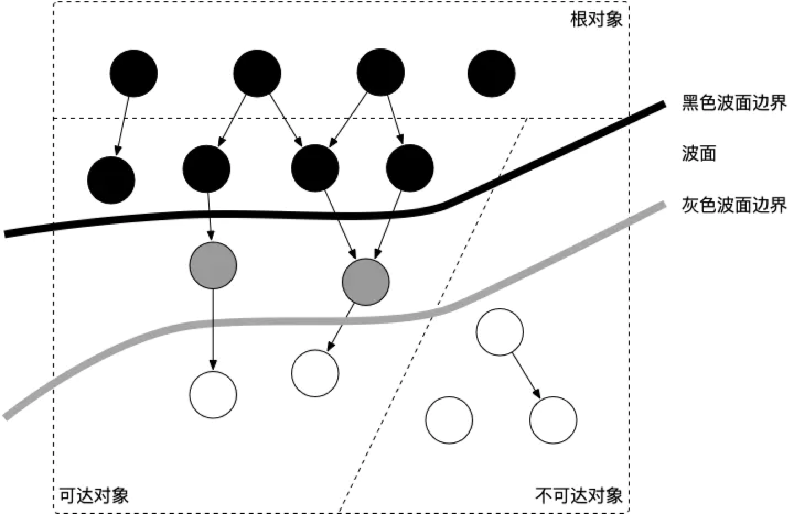
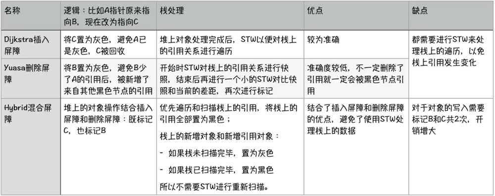

# 【Golang】GC探秘/写屏障是什么？
[refer](https://www.jianshu.com/p/52ab0bebefa0)

之前写了 一篇[【Golang】内存管理](https://www.jianshu.com/p/1f0a0ec2d661) ，有了很多的阅读量，那么我就接着分享一下Golang的GC相关的学习。

由于Golang的GC机制一直在持续迭代，本文叙述的主要是Go1.9版本及以后的GC机制，该版本中Golang引入了 混合写屏障大幅度地优化了STW的时间。具体GC机制的版本迭代可以参考 ：[GC的过去、现在和未来](https://golang.design/under-the-hood/zh-cn/part2runtime/ch08gc/history/)

## 基本概念
### GC的对象
不再被需要的内存块，如果无法回收这部分内存将无法重复使用

### 内存泄漏
不再被需要的内存块，未在预期时间以内被回收的称为内存泄漏

### 常见的GC方法：
1.【PHP，Swift，Python等】引用计数法：

每个对象维护一个自身被引用的次数，当一个引用者消息后该计数-1；
它的优势为GC时查找需要回收的对象很简单：只需要找到引用计数为0的对象即可；
它的劣势为在写入引用关系时需要额外维护引用计数，带来一定开销 ；
2.【Golang】标记清除法：
每次GC时通过从根对象出发递归地查询所有对象的引用关系，将无引用的对象进行标记后再行清理。
它的优势在于写入引用关系时无额外开销
它的劣势在于GC时查询引用关系有一定开销 ，有时还需要STW从而影响性能
### STW: Stop the world
为了避免在GC的过程中，对象之间的引用关系发生新的变更使得GC的结果发生错误（比如GC过程中新增了一个引用，但是由于未扫描到该引用导致将被引用的对象清除了），停止所有正在运行的协程。
STW对性能有一些影响，Golang目前已经可以做到1ms以下的STW。

### 三色标记法
Golang中的GC方式为标记后清除，所采用的逻辑为——三色标记法：一开始全部的对象都是白色的

## 三色标记法
[三色标记法动态演示图](https://zhuanlan.zhihu.com/p/74853110)

[三色标记法图解](https://zhuanlan.zhihu.com/p/334999060)

从root对象开始（全局变量+全局栈+当前活跃的goroutines中的栈），将它们加入到灰色队列中，进行遍历：类似于二叉树使用队列进行BFS遍历的过程
从灰色队列中pop出一个对象
将其引用的对象都置为灰色，加入到灰色队列中
将该对象置为黑色
直到灰色队列为空时，剩余的无引用的白色对象即会被清除
## 内存回收
看不太明白的可以参考我的上一篇文章：[【Golang】内存管理](https://www.jianshu.com/p/1f0a0ec2d661)

被回收的内存块会被回收到MCache（Processor私有内存）结构中 ，对应的MSpan（块类型）的allocBits的bitmap中对应的位置会被从1改为 0
MSpan中除了allocBits还有另一个bitmap：GCMarkBits用于存放需要清除的标记：黑色=1，白色=0，一次GC之后所有MSpan中的GCMarkBits和AllocBits应该完全相同，因为只有黑色的内存对象在GC之后才会保留下来
## 写屏障
上文有提到为了避免GC的过程中新修改的引用关系到GC的结果发生错误，我们需要进行STW。但是STW会影响程序的性能，所以我们要通过写屏障技术尽可能地缩短STW的时间。

### 造成引用对象丢失的条件
一个黑色的节点A新增了指向白色节点C的引用
并且白色节点C没有除了A之外的其他灰色节点的引用，或者存在但是在GC过程中被删除了
**以上两个条件需要同时满足：满足条件1时说明节点A已扫描完毕，A指向C的引用无法再被扫描到；满足条件2时说明白色节点C无其他灰色节点的引用了，即扫描结束后会被忽略。**

### 写屏障破坏两个条件其一即可
破坏条件1 => Dijkstra( /ˈdɛɪkstra/)写屏障
满足强三色不变性：黑色节点不允许引用白色节点
当黑色节点新增了白色节点的引用时，将对应的白色节点改为灰色
破坏条件2 => Yuasa写屏障
满足弱三色不变性：黑色节点允许引用白色节点，但是该白色节点有其他灰色节点间接的引用（确保不会被遗漏）
当白色节点被删除了一个引用时，悲观地认为它一定会被一个黑色节点新增引用，所以将它置为灰色
### 写屏障的分类
**注意：由于栈上的操作需要保证性能，所以所有的写屏障均只针对堆上的对象。**

### GC的时机
每次内存分配时检查当前内存分配量是否已达到阈值（环境变量GOGC）：默认100%，即当内存扩大一倍时启用GC
定时触发：当最近2分钟未触发过GC时，会触发一次GC
通过runtime.GC()手动触发
### GC的优化
分配的对象越多，GC性能就越差，所以需要减少对象分配的个数，比如对象复用，使用sync.Pool

注意：sync.Pool类似于缓存，其中的对象会被定期清理（GC时清理），不能放置像是数据库连接这样需要稳定存储的数据

## 参考
1. [三色标记法是什么？](https://www.bookstack.cn/read/qcrao-Go-Questions/spilt.4.GC-GC.md)
2. [Go语言垃圾收集器原理](https://draveness.me/golang/docs/part3-runtime/ch07-memory/golang-garbage-collector/)